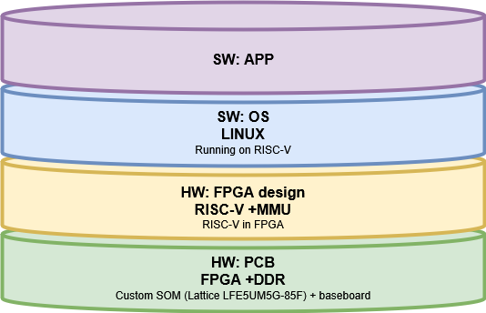

# FPGA4RISCV
This project is an attempt to build hardware (SOM and baseboard) capable for runnig Linux on RISCV MCU implemented in FPGA.
## This is work in progress, not finished project (!).
Overview (): 

[Edit this diagram](https://app.diagrams.net/?url=https://raw.githubusercontent.com/even-notodd/FPGA4RISCV/DOCs/architecture.drawio)

# SOM
SOM is supposed to be designed in a format of a SO-DIMM card (Small Outline Dual Inline Memory Module) with standard 200 pin
SoM is based on Lattice FPGA chip LFE5UM5G-85F with dedicated DDR memory.

# Baseboard
Baseboard is supposed to be more or less generic baseboard and planned to be used with other SoMs. Concequently it must have:
- Power supply with several standard voltages
- Ethernet
- USB 2.0 Phy & USB Hub
- USB 3.0
- USB-JTAG
- USB-UART
- GPIO headers
- UART/I2C/SPI headers
- HDMI

## License
See the  for details. 
